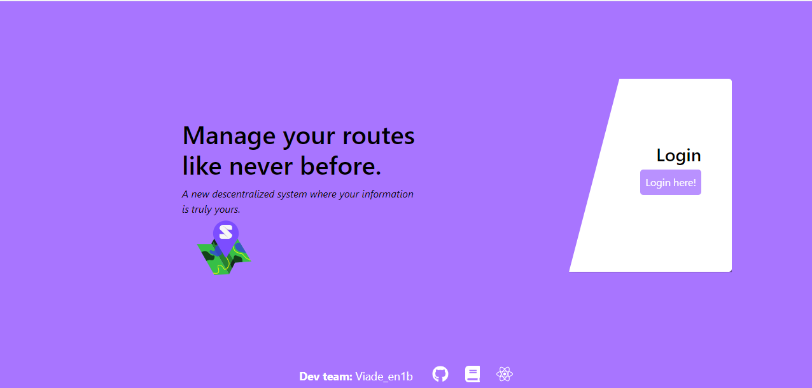

[](https://travis-ci.org/Arquisoft/viade_en1b)
[](https://codecov.io/gh/Arquisoft/viade_en1b)
[](https://www.codacy.com/gh/Arquisoft/viade_en1b?utm_source=github.com&utm_medium=referral&utm_content=Arquisoft/viade_en1b&utm_campaign=Badge_Grade)

# VIADE EN1B

This repository contains a skeleton of the VIADE project.

This project is an assignment for the [Software Architecture course](https://arquisoft.github.io/) following [these requirements](https://labra.solid.community/public/SoftwareArchitecture/AssignmentDescription/).

More information about how this project has been setup is available [in the wiki](https://github.com/Arquisoft/viade_en1b/wiki).

---

[Check it out!](https://arquisoft.github.io/viade_en1b/)

## Contributors

- Marcos Álvarez García — [alvarezGarciaMarcos](https://github.com/alvarezGarciaMarcos)
- Pelayo García Álvarez — [garciaAlvarezPelayo](https://github.com/garciaAlvarezPelayo)
- Álvaro García Infante — [alvaro_garinf](https://github.com/alvarogarinf)
- Íñigo Gutiérrez Gernández — [InigoGutierrez](https://github.com/InigoGutierrez)
- Eduardo Lamas Suárez — [lamasumas](https://github.com/lamasumas)
- César García Cabeza — [themrcesi](https://github.com/themrcesi)

## Documentation

The documentation is available [here](https://arquisoft.github.io/viade_en1b/docs).

## Development

This project was generated using [Create React App](https://create-react-app.dev/).

### Getting started

In order to run this project, you will need to follow these steps:

1. Install [Ruby](https://www.ruby-lang.org/es/)

> We recommend to install ruby using [RubyInstaller](https://rubyinstaller.org/)

1. Install [Node](https://nodejs.org/) & [NPM](https://www.npmjs.com/)

1. Install [asciidoctor](https://asciidoctor.org/)

   1. Then, install [asciidoctor-diagram](https://asciidoctor.org/docs/asciidoctor-diagram/):
      ```shell
      gem install asciidoctor-diagram
      ```
      > In windows issue this command using the terminal provided by RubyInstaller. In linux `sudo` may be needed, depending on the installation.

1. Run

```shell
npm install
```

to have all the dependencies needed.

### Generating the documentation

Execute

```shell
npm run docs
```

to generate the html documents and dependencies (all the documents will be stored in `/build/docs`).

### Development server

If you want to test the application in your local machine, you will need run a development server in your machine.

1. Run `npm start`.
2. Go to your browser and navigate to `http://localhost:3000/viade_en1b`.

### Building the application

If you want to build the application you need to run `npm run build` and all the files will be stored in `/build`.

### Running unit tests

If you have any development server running, close it please, because tests need the port 3000 in order to run (solid stuff :smile:).

To execute the unit tests, you need to run `npm test`.

> This tests have been created using [Jest](https://jestjs.io/).

### Running end-to-end tests

First of all run `npm start` and then run `npm run cucumber`.

> This tests have been created using [Cucumber](https://cucumber.io/) and [Selenium](https://www.selenium.dev/).

### Running load tests

First of all you need to run the development server with `npm start`.

TODO

> This tests have been created using [Artillery](https://artillery.io/).

### Docker

In order to use our Dockerized application, you have yo have Docker installed on your computer. Once that's done, you have to follow these steps:

- Open a command prompt.
- Set yourself on the root directory of our cloned repo
- Type the following command:

  - `shell docker build -t viadeapp`
    - This will build the Docker image for you, that can be run later on a container.
  - `shell docker run -p 80:3000 viadeapp`
    - This will launch a container with the viadeapp image, and will expose map your localhost port 80, to the container port 3000.

- Now, the only thing you have to do is to go to your favourite web browser, and browse to: http://localhost and you will be served with the Viade app!

### Further help

To get more help on the React use `npm help` or go to their [main webpage](https://es.reactjs.org/).

---

## Application



### Accessibility

We are concerned about every kind of users, specially color blind people.

Regarding this fact, we have included a functionality to change in runtime the theme of our application in order to solve the main three color blindnesses:

1. Protanopia: confusion of reds and greens and loss of sensitivity to red light.
2. Tritanopia: confusion of blues and greens an which sensitivity to blue is reduced.
3. Deuteranopia: confusion of blues and greens, of greens and reds and which sensitivity of green is reduced.

### Internationalization

Currently, our application is internationalized for English and Spanish.

> This have been done using [React Intl](https://github.com/formatjs/react-intl).

### Basic use

If you want to know about how to use our application, you can go to our [user manual](https://lamasumas.github.io/Solid/).
